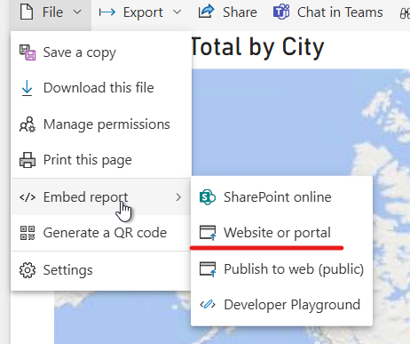
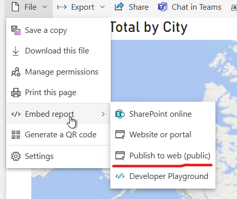
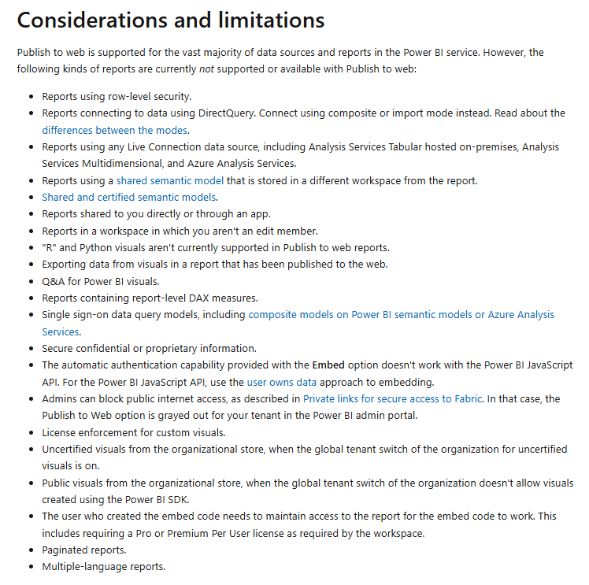

# all4mepublicsite

## Publish Power BI report on Website

Following two separate way to publish Power BI report on web site

### WAY 1: Secure embedding

Using  "Website or portal"

In this way, an access login is required. And you should have Power BI license (unless specific capacity size)

<iframe title="AdventureWorks_Report" width="1140" height="541.25" src="https://app.powerbi.com/reportEmbed?reportId=a024583e-0c11-43b4-a8ba-799b6d36ee3a&autoAuth=true&ctid=e301c34d-8dfc-445f-b32f-9ce102596439" frameborder="0" allowFullScreen="true"></iframe>

### WAY 2: Publish to web

[REF LINK: Publish to web](https://learn.microsoft.com/en-us/power-bi/collaborate-share/service-publish-to-web)

Report published with "Publish to web"

When you use Publish to web, anyone on the Internet can view your published report or visual. 
**Viewing requires no authentication**
Report is interactive and can be fully navigated as report below

<iframe title="AdventureWorks_Report" width="600" height="373.5" src="https://app.powerbi.com/view?r=eyJrIjoiNDY0NGQ1MTctM2M5NC00NWFhLThkODctN2EzNWJiOGRlMjEyIiwidCI6ImUzMDFjMzRkLThkZmMtNDQ1Zi1iMzJmLTljZTEwMjU5NjQzOSIsImMiOjZ9" frameborder="0" allowFullScreen="true"></iframe>

#### Considerations and Limitations

Publish to web has some limitations reported below. Feel free to navigate
We can see that the report is interactive and can be fully navigated

